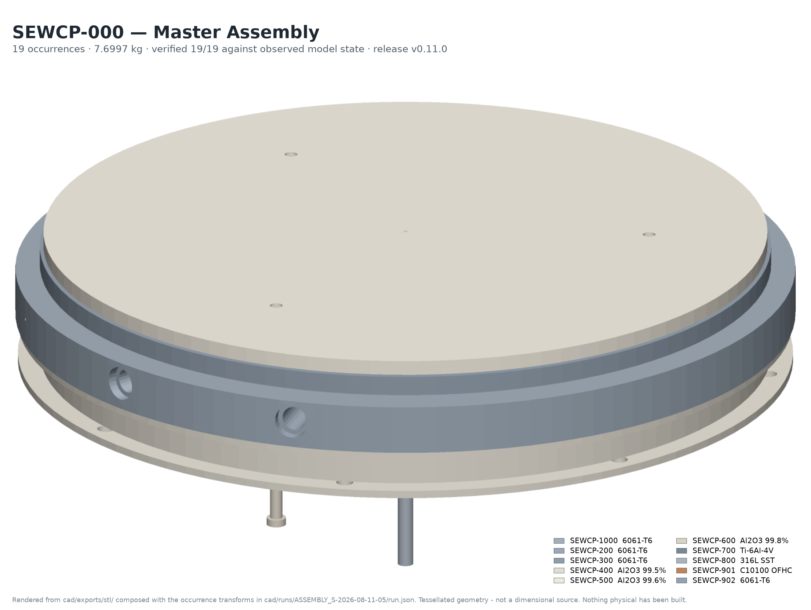

# AIEF — Agent-Driven Semiconductor CAD Engineering

**An engineering pipeline that converts governed semiconductor-equipment requirements into
parametric Fusion 360 designs, verifies the resulting geometry against the requirement from the
model Fusion actually built, and iterates through failure-recovery loops before release.**

The demonstration hardware is **SEWCP** — a 300 mm bipolar electrostatic chuck pedestal for
RF-biased plasma process equipment.



<sub>*SEWCP-000 master assembly. Rendered from the released STL exports composed with the
occurrence transforms in `cad/runs/ASSEMBLY_S-2026-08-11-05/run.json` — every placement
reconciled against the bounding box Fusion actually observed before it was drawn. Tessellated
geometry, not a dimensional source.*</sub>

| | | | |
|---|---|---|---|
| **9** components specified | **10** part designs verified | **19** assembly occurrences | **19 / 19** system verification |
| **11** drawings / **14** sheets | **79** dimensions, **0** unsourced | **61** deliverables, digest-registered | **895** tests pass |
| **36** CAD runs tracked — **18 of them failures** | **5** independent QA rounds, **4** `NOT CLEARED` | **`v0.11.0`** released | **0 of 91** hardware requirements physically verified |

> **Read this before anything else.** The digital release is complete and reproduces from a clean
> clone. **Nothing physical has been built or measured**, and one defect is open against the
> design itself — `ECR-D-016`, the Support Ring isolation joint does not close. **Do not build to
> this baseline.** Details in [Physical qualification boundary](#physical-qualification-boundary).

**Start here:** [Recruiter overview](docs/RECRUITER_OVERVIEW.md) ·
[Architecture](docs/ARCHITECTURE.md) · [How it failed and recovered](docs/FAILURE_RECOVERY.md) ·
[Verification](docs/VERIFICATION.md) · [Independent QA](docs/QA.md)

---

## What I built

- A **Fusion 360 add-in and file-queue protocol** — 32 operations — that drives the modeller and
  reports back **what it observed**, not that the call succeeded. Fusion has no external
  automation API; code inside its own process is the only supported route.
- An **observation-based verification layer**: three independent verifiers (geometry, interface,
  constraint) that read the live model and score it against requirement-derived acceptance
  criteria. **No verifier reads whether the CAD command executed.**
- A **bounded failure-recovery loop** with root-cause classification by owning layer,
  digest-enforced no-blind-retry, capped attempts, and a document lifecycle where a design is
  **saved only on verified PASS**.
- **AIEF**, the governance framework around it: 13 laws, 12 role contracts, 25 validation rules,
  a six-stage compiler, a hash-chained ledger, and 8 standing checks that *compute* the
  properties the documents claim.
- The **SEWCP engineering specification** — Volumes 00–09, 137 numbered component requirements,
  frozen — and the CAD, drawings, BOM and analyses produced under it.

## The core idea

> **A CAD operation succeeding is not evidence that it worked.**

`extrude(...)` returning OK means Fusion accepted the operation. It says nothing about whether
the resulting solid satisfies the requirement. So three facts are kept apart and never merged:

| Fact | Reported by |
|---|---|
| An agent **requested** an operation | the orchestrator |
| Fusion **performed** it | Fusion, about its own work |
| The model **satisfies** the requirement | an independent verifier reading observed state |

Only the third is acceptance. Everything else is a claim.

## How it works

```
  spec/**  frozen, hash-registered
     │  requirements → design solution → operation sequence
     ▼
  CAD bridge  ──── file queue ────►  Fusion 360 + AIEF_CAD_Bridge add-in
     ▲                                          │
     │                           OBSERVED model state — extents, volume, mass,
     │                           material, parameters, sketches, planes, features
     │                                          ▼
     │                              independent verification
     │                               ╱                    ╲
     └── repair ◄── diagnose ◄── FAIL                    PASS ──► save · export
         (bounded)                  ╲                              draw · release
                                     └─► escalate (ECR)
```

Diagram: [`docs/assets/architecture.svg`](docs/assets/architecture.svg) · full detail:
[`docs/ARCHITECTURE.md`](docs/ARCHITECTURE.md).

## SEWCP demonstration

| | |
|---|---|
| Wafer | 300 mm × 775 µm |
| Chucking | Coulombic, bipolar, ±500 to ±2000 VDC |
| Wafer plane above Datum A | 55.920 ± 0.150 mm |
| Wafer temperature | 20–150 °C, ±2.0 °C across Ø300 |
| Coolant | 4 L/min, Re ≈ 8,300, 3 kW capacity |
| Heater | 2 zones, 2000 W |
| RF bias | 13.56 MHz, ≤ 1000 W |

Nine specified components — cooling plate, heater plate, ceramic support ring, electrostatic
chuck, lift pins, alignment pins, vacuum port, RF feedthrough bracket, temperature sensor bracket
— realised as ten part designs and one master assembly. The Base Plate `SEWCP-100` is frozen and
out of scope.

## Results

| Item | Result | Computed by |
|---|---|---|
| Gate `LC-M04-EXIT` | **PASS** C1–C7 | `python -m aief_gate` |
| Feature clearance, `spec/00` §3.2 | **PASS**, pair by pair | `python -m aief_clearance` |
| Parameter master | **105** derived | `python -m aief_params check` |
| Approval chains | **CLEAN** | `python -m aief_approval verify` |
| Deliverables | **61 registered, 61 reproduce, 0 unregistered** | `python -m aief_deliverables` |
| Freeze registry | **31 of 31 verify** | `V-24` |
| Boot step B2a, core integrity | **75 / 75**, independently recomputed | `python -m aief_stage6` |
| System interfaces | **12 / 12** | `cad/runs/SYSTEM_INTERFACES.json` |
| Assembly | **19 occurrences**, PASS, 7.6997 kg | `cad/runs/ASSEMBLY_S-2026-08-11-05/` |
| Final system verification | **19 / 19** | `cad/runs/FINAL_SYSTEM_VERIFICATION.json` |
| Tests | **895 local · 843 from a clean clone**, 0 fail | `pytest tests/` |

Every figure above is measured at the release commit `f8ff028`. Two standing checks exit non-zero
**and are meant to**: `aief_analysis`, because `ECR-D-016` does not close, and `aief_exec check`,
which reports three open exec-layer conditions of its own. A check reporting PASS on an open
defect would itself be the defect.

> **This file is a governed deliverable, and rewriting it is a recorded act.** `README.md` is
> pinned by DC-1 in a result record, so the portfolio rewrite moved its digest and `X-06` — the
> drift detector — reported the record STALE. That is the mechanism working. It was answered the
> way the architecture prescribes: **by supersession, never by mutation.** `R-031` republishes
> the digest, seals `R-030` at the state it now stands at, and `R-030` itself is preserved.
> [`docs/DOCUMENTATION_FINDINGS.md`](docs/DOCUMENTATION_FINDINGS.md) §6.

## Engineering failure → recovery → verification

Two M6 hanger taps in the cooling plate. **Eight operations dispatched, eight executed, zero
Fusion errors.** A clean run by any normal measure of CAD automation.

It failed:

```
ACC-VOL   body:CP_BODY.volume_mm3   requirement CP-HANGER-TAP
expected  1479108.9
observed  1479282.6100163697
detail    delta 173.71 exceeds tolerance 1
```

The taps were breaking into the outer thermal-choke slots, so they removed 504.8 mm³ instead of
678.6 mm³. The bounded loop re-dispatched twice, made no progress, and **escalated rather than
degrading into a pass**. The failure disposition tried to discard the document and was *refused
by contract* — `a saved design is never discarded by recovery` — and reverted instead.

Then the finding that justifies the whole architecture: a feasibility sweep proved **no compliant
position existed anywhere inside the placement window the specification itself had given.** The
requirement was wrong, not the model. Corrected placement ruled, cleared against nine
neighbouring features, specification rows re-issued under approval, re-run — **PASS on the first
attempt, observed volume within 0.04 mm³**, and only then was the document saved.

Elapsed: **5 min 13 s**. Full trace, plus a second case:
[`docs/FAILURE_RECOVERY.md`](docs/FAILURE_RECOVERY.md).

The repository tracks **36 CAD runs, 18 PASS and 18 FAIL.** The failures are committed on
purpose — a record containing only successes has not shown you its verification working.

## Independent QA

**LAW-05: no role verifies its own output.** Independence is supplied by a **cold-context
session** that reconstructs every fact from the repository, recomputes without importing the code
under audit, writes no repository file, and returns a verdict the repairing session did not
choose.

Five rounds ran against this release. **Four returned `NOT CLEARED`**, and each found a real
defect in a repair that looked complete — including a ruling enforced only on a non-canonical
code path, which survived all 846 tests, and a check written to end a recurring defect that did
not catch that defect.

Two of their recomputations contradicted the repository and were right: the deliverables were not
byte-identical to the generation root, and the suite did not pass from a clean clone.

And the finding that is not closed: **four consecutive repair sessions each introduced a defect
of the class they were repairing** (`OI-V-17`). Recorded, not quietly repaired.

[`docs/QA.md`](docs/QA.md).

## Engineering deliverables

61 files, 4,995,097 bytes, every digest registered in [`cad/DELIVERABLES.md`](cad/DELIVERABLES.md)
and checked **both directions**.

| | |
|---|---|
| Neutral geometry | **11 STEP** — 10 parts + the master assembly — `cad/exports/step/` |
| Tessellated | **10 STL** — `cad/exports/stl/` |
| Drawings | **11 documents / 14 sheets** — SVG + PDF, with a provenance sidecar naming the source of **every one of 79 dimensions** — `drawings/` |
| BOM | indentured Rev A, cross-checked four ways — `cad/bom/` |

The parametric `.f3d` is deliberately **not** here: `SEDEP-PMP-002` §3.1 places the parametric
source of record in Fusion cloud versioning and git holds the neutral record.
[`docs/DELIVERABLES.md`](docs/DELIVERABLES.md).

## Architecture

| Layer | What it holds |
|---|---|
| **Specification** | `spec/` — Volumes 00–09, frozen and hash-registered; 137 numbered component requirements |
| **Agents** | `src/aief_cad/agents.py` + `.ai/core/agents/` — domain-bounded contributions; 12 role contracts |
| **CAD bridge** | `src/aief_cad/bridge/` + `fusion_addin/AIEF_CAD_Bridge/` — file-queue transport, 32 operations |
| **Observation** | `src/aief_cad/observe.py` — *absence is represented as absence* |
| **Verification** | `src/aief_cad/verify/` — geometry · interface · constraint |
| **Recovery** | `src/aief_cad/loop.py` — classify, repair bounded, or escalate |
| **Framework** | `framework/` + `.ai/` — laws, gates, approvals, hash-chained ledger, six-stage compiler |
| **Standing checks** | `src/` — eight packages that compute what the documents claim |

[`docs/ARCHITECTURE.md`](docs/ARCHITECTURE.md).

## Repository structure

```
spec/            frozen engineering specification, Volumes 00–09
implementation/  per-component requirement packages (the executable input)
src/             aief_cad, aief_gate, aief_clearance, aief_params, aief_approval,
                 aief_deliverables, aief_register, aief_analysis, aief_exec,
                 aief_stage6, aief_draw, sedep
fusion_addin/    AIEF_CAD_Bridge — the Fusion 360 add-in
cad/             runs (tracked evidence, failures included), exports, bom, bridge
drawings/        generator, definitions, released SVG + PDF + provenance sidecars
analysis/        tolerance stack, thermal, structural, electrical/RF, flow
framework/  .ai/ AIEF — laws, roles, gates, ledger, validation, compiler output
tests/           895 tests
docs/            portfolio and presentation layer (this pass)
```

## Reproducing the system

```bash
git clone https://github.com/Raar1999/SEWCP_Master_Assembly.git
cd SEWCP_Master_Assembly
python -m venv .venv && . .venv/Scripts/activate     # Windows; bin/activate on POSIX
pip install -r requirements.txt

PYTHONPATH=src python -m aief_gate            # LC-M04 CAD-READY: YES              exit 0
PYTHONPATH=src python -m aief_clearance       # CLEARANCE OK                       exit 0
PYTHONPATH=src python -m aief_params check    # PARAMETERS OK  105                 exit 0
PYTHONPATH=src python -m aief_approval verify # APPROVAL CHAINS OK                 exit 0
PYTHONPATH=src python -m aief_deliverables    # 61 registered, 61 reproduce        exit 0
PYTHONPATH=src python -m aief_register        # REGISTERS OK                       exit 0
PYTHONPATH=src python -m pytest tests/ -q     # 843 passed, 52 skipped, 0 failed
PYTHONPATH=src python -m aief_analysis        # 4 of 5 FAIL — ECR-D-016            exit 1
```

**These are the numbers a clone actually produces**, measured by cloning this repository from
GitHub and running the battery against it — not the numbers from the author's machine.

The 52 skips measure token budgets through two normative tokenizer families whose artifacts are
third-party binaries and are not tracked. Nothing estimates in their absence — the governing rule
makes absence **block** rather than estimate — so they skip rather than guess. Provision both in
`build/stage6/tokenizer_artifacts/` and the suite runs **894 passed, 1 skipped**; the last skip
needs `build/stage6/detcheck/`, which is gitignored and which no code here creates, so it is
unreachable from a clone by any route.

| Family | File | Raw-octet SHA-256 pinned in `core/MANIFEST.lock` |
|---|---|---|
| TF-1 | `cl100k_base.tiktoken` | `223921b76ee99bde995b7ff738513eef100fb51d18c93597a113bcffe865b2a7` |
| TF-2 | `spiece.model` (T5 SentencePiece) | `d60acb128cf7b7f2536e8f38a5b18a05535c9e14c7a355904270e15b0945ea86` |

With a sibling `TRUST_ON_FIRST_USE.json` present, **a digest mismatch is a loud failure and the
measurement is refused** — never a silent re-pin.

**This reproducibility gap was itself a defect, and it was found the only way it could be.** These
tests once *failed* on a clone while passing at the desk, so the README claimed a reproducibility
that had never been tested from outside. Recorded as `OI-V-16`; the `validate` workflow now runs
the battery on GitHub's runners, where there is no author's machine to be lucky on.

**What a clone cannot reproduce at all:** the Fusion designs live in Autodesk cloud versioning, so
regenerating `cad/` needs Fusion 360 with the add-in installed. Everything else — every gate,
every digest, the drawing set, the BOM and the whole test suite — runs offline.

## Physical qualification boundary

**This repository is a design and process artifact, not a qualified product.**

| | |
|---|---|
| Numbered component requirements | **137** |
| Desk-dischargeable — design, drawing, analysis, calculation | **46** |
| **Hardware required** | **91** |
| **Verified by physical evidence today** | **0** |

No article has been built. Nothing has been measured. The four mass figures are labelled
`MODEL-PREDICTED`, never verified — the declared method is *Scale*, and a scale needs a part. The
record is [`PVR-001`](.ai/project/verification/PVR-001_Physical_Verification_Record_And_Test_Matrix.md),
and it contains **no test result**.

A model establishes geometry and the properties that follow from geometry and a density. It
establishes **nothing** about pressure drop, heat transfer coefficient, leak rate, temperature
uniformity, contact resistance, inductance, particle generation, outgassing, cycle life,
dielectric strength or dechuck behaviour.

**And one defect is open against the design itself.** Filing the creepage/clearance trace that an
open item recorded as owed found that
[**the Support Ring isolation joint does not close**](.ai/project/ecr/ECR-D-016_Support_Ring_Isolation_Joint_Does_Not_Close.md):

| | Required | Computed |
|---|---|---|
| `SR-04` clearance | ≥ 12.00 mm | **8.50 mm** — the greatest any hardware choice can offer |
| `SR-03` creepage | ≥ 20.00 mm | **14.00 mm** as modelled; 17.42 mm at best |
| `SR-02` shunt impedance at 13.56 MHz | ≥ 400 Ω | **353.94 Ω** |

One root cause: two sections of `spec/03` compute a flange gap as empty while a third puts a
6.00 mm grounded ring inside it. It is ruled, its remedy is computed, and it is **deliberately not
implemented here**, because implementing it is a specification re-baseline.
**Do not build to this baseline.**

## Release

| | |
|---|---|
| Release | **`v0.11.0`** — CAD and software complete |
| Commit | `f8ff028`, annotated tag `v0.11.0`, remote `HEAD` verified identical |
| Engineering baseline | SEWCP Rev A, Volumes 00–09 — **FROZEN** |
| Framework | AIEF 1.0.0 — **FROZEN**, fifteen amendments |
| Hardware build | **BLOCKED** by `ECR-D-016` pending a Rev B baseline revision |
| Physical qualification | **NOT STARTED** |

Everything open is at [`.ai/project/OPEN_ITEMS.md`](.ai/project/OPEN_ITEMS.md) with the full record
at [`OPEN_ITEMS_REGISTER.md`](.ai/project/OPEN_ITEMS_REGISTER.md). Nothing is hidden there,
including the failures. [`docs/RELEASE.md`](docs/RELEASE.md) ·
[`CHANGELOG.md`](CHANGELOG.md).

## Navigating

| If you want to… | Go to |
|---|---|
| Understand the project in two pages | [`docs/RECRUITER_OVERVIEW.md`](docs/RECRUITER_OVERVIEW.md) |
| Work in this repository | [`ENGINEERING.md`](ENGINEERING.md) → [`.ai/BOOT.md`](.ai/BOOT.md) |
| Read the engineering baseline | [`spec/README.md`](spec/README.md) |
| Understand datums, budgets, design rules | [`spec/00_…Architecture_and_Interface_Control.md`](spec/00_SEWCP-ENG-001_Architecture_and_Interface_Control.md) |
| See engineering decisions and their alternatives | [`.ai/project/decisions/`](.ai/project/decisions/) |
| See what only hardware can settle | [`PVR-001`](.ai/project/verification/PVR-001_Physical_Verification_Record_And_Test_Matrix.md) |
| Find any document | [`INDEX.md`](INDEX.md) |
| Contribute | [`CONTRIBUTING.md`](CONTRIBUTING.md) |

## Licence

**`MIT AND CC-BY-4.0`** — dual-licensed, and which licence applies to a file is determined by its
path and by nothing else. **MIT** for software (`src/`, `tests/`, `scripts/`, `fusion_addin/`,
`drawings/defs/`, `cad/scripts/`, `*.py`); **CC-BY-4.0** for documents, engineering artifacts and
generated design data (`spec/`, `program/`, and the remaining document trees). Both full texts are
embedded so the licence survives without a network. §3 states expressly that **no patent and no
trademark licence is granted, and that the design is not qualified hardware.**
[`LICENSE`](LICENSE) is authoritative.

## Provenance

The engineering work in this repository — specification, CAD, drawings, analysis, the framework
and its tooling — was produced by an AI agent under human owner authority, with decision authority
delegated for specified runs and every delegated decision recorded as such in
[`.ai/project/decisions/`](.ai/project/decisions/). Human approvals and delegated decisions are
distinguished everywhere they appear, and **a delegated decision is never recorded as a human
approval.** Where a governing rule requires a genuinely independent party — LAW-05 — independence
is supplied by a cold-context session or the item stays open.

Repository policy, binding and in force: no AI attribution in any commit, file or document; no
`Co-authored-by` trailers; git author information is never modified; `spec/` is frozen and defects
are raised as an ECR rather than edited in place; and no engineering decision is made in a commit.
Full text: [`CONTRIBUTING.md`](CONTRIBUTING.md) §1.
