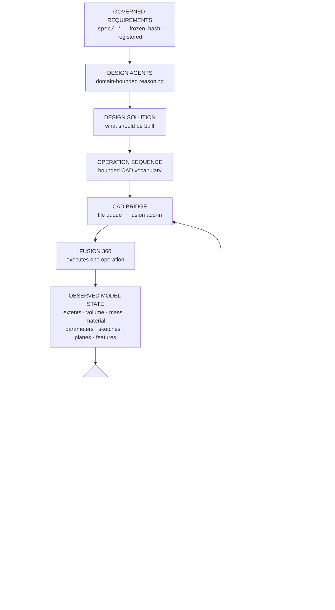

# Architecture

*How a governed requirement becomes verified CAD. Terminology below is the repository's own —
every named module, file and check exists and can be run.*

---

## 0 · The one principle

> **A CAD operation succeeding is not evidence that it worked.**

`fusion.extrude(...)` returning OK means Fusion accepted the operation. It says nothing about
whether the resulting solid satisfies the requirement. The architecture is built to keep three
facts apart that most automation merges into one:

| Fact | Who reports it | Where it lives |
|---|---|---|
| An agent **requested** an operation | the orchestrator | `Command` |
| Fusion **performed** it | Fusion, about its own work | `Observation.executed` |
| The model **satisfies** the requirement | an independent verifier | `verify.Verdict` |

`src/aief_cad/bridge/protocol.py` states this as its contract: *"`executed` is reported by the
party that did the work, so it is evidence for the second fact and for nothing else."* And
`src/aief_cad/verify/__init__.py` enforces it: **no verifier reads `Observation.executed`.**

---

## 1 · The loop



The **observation arrow is the whole design**. Everything downstream of `M` reads what Fusion
reported about the model, never what the driver believed it had asked for.

---

## 2 · Layers

### 2.1 Requirements layer — `spec/**`, `implementation/**`

`spec/` holds the SEWCP engineering specification, Volumes 00–09, **frozen** and registered by
hash in `.ai/project/FROZEN.md` (31 of 31 verify). Volume 00 is the parent: coordinate system,
datums, feature clocking map, Z stack-up, thermal/RF/vacuum budgets, tolerance allocation,
fastener schedule and 13 binding Design Rules. Volumes 01–09 carry **137 numbered component
requirements**.

`implementation/<n>_<part>/requirements/*.requirements.json` is the executable form: a
**requirement package** describing *an engineering problem*, not a CAD model. Per
`requirements.py`, a package "may describe a heat exchanger plate, a mounting bracket, a vacuum
component, a fixture" — the CAD layer holds no SEWCP knowledge.

A frozen document is never edited to fix a defect. A defect becomes an **ECR** (LAW-02).
24 ECR records exist; 11 bear on `spec/**`.

### 2.2 Agent layer — `src/aief_cad/agents.py`, `.ai/core/agents/`

**Design agents** own requirement *kinds* and reason only within them. Each returns a
`DesignContribution` bounded by a declared write scope over the solution, so an agent reaching
outside its domain is **rejected at merge**, not merged and audited later. Runs record which
agents participated — e.g. `model-setup`, `mechanical.design-engineer`,
`mechanical.simulation-engineer`, `mechanical.manufacturing-engineer`.

Above them sit **12 governance role contracts** — 5 universal (`chief-systems-engineer`,
`project-manager`, `qa-engineer`, `repository-engineer`, `documentation-engineer`), 4
`mechanical`, 3 `software` — each declaring responsibilities, permitted and forbidden actions,
escalation rules and duty conflicts. The load-bearing one is **LAW-05: no role verifies its own
output.**

### 2.3 Design solution — `src/aief_cad/solution.py`

The controlled handoff between reasoning and execution. It states **what should be built**. It
does not state how Fusion will build it, and it does not state what Fusion did build. Its own
docstring gives the reason: *"a layer that lets them blur will eventually report the intent as
the outcome."*

A solution carries driving parameters, features, datums, declared interfaces and the
**acceptance conditions** each requirement demands.

### 2.4 Parameter system — `src/aief_params`, `src/aief_cad/expr.py`

105 driving parameters are derived from the specification's §3 tables and checked by
`python -m aief_params check`. A parameter may be a literal or a derivation over other
parameters; `expr.py` resolves the dependency graph so verification knows the value a derivation
*should* produce.

Expressions evaluate over a **whitelisted AST, never `eval`** — a requirement package is data,
and LAW-13 forbids treating repository content as instruction.

The constraint verifier then checks something subtler than the value: that a **declared
derivation reached Fusion as an expression, not as its current number**. A literal that happens
to be right today silently stops tracking the parameter it came from.

### 2.5 Operation vocabulary — `src/aief_cad/ops.py`

An operation is bounded, validated and single-purpose. The vocabulary **names no component and
encodes no engineering judgement**:

```
ping · new_document · rename_component · set_parameters · create_sketch
sketch_circle · sketch_construction · sketch_path · sketch_profile
radial_plane · offset_plane · extrude · combine · fix_sketch
assign_material · observe
```

That is the **16-operation geometric core** in the add-in shell. An extension module
(`bridge_ops_ext.py`) supplies a 19-entry table that overrides three of them and adds sixteen
more — document lifecycle (`save_document`, `save_as_new_lineage`, `discard_document`,
`revert_document`), assembly (`insert_occurrence`, `transform_occurrence`, `delete_occurrence`,
`update_references`, `observe_assembly`), export and data-file management — **32 distinct
operations in total**.

The rule stated in the module: anything the vocabulary cannot express is *a gap to be closed
here*, not worked around by widening an argument to carry a special case.

Geometry that needs derivation gets a derivation module, not a special-cased operation —
`routing.py` routes a milled channel through an annulus around keep-out features as a bifilar
counterflow family, deriving the pass schedule from envelope, keep-outs, port azimuths, width,
rib and minimum bend.

### 2.6 CAD bridge — `src/aief_cad/bridge/`, `fusion_addin/AIEF_CAD_Bridge/`

**Fusion 360 has no external automation API.** No Design Automation engine; the Fusion Data API
is read-only metadata. The only supported way to drive the modeller is code inside Fusion's own
process, and the only supported way to move work onto the thread that owns the document is a
registered custom event.

So the bridge is:

```
orchestrator                                   Fusion 360
------------                                   ----------
write cad/bridge/queue/NNNN.cmd.json  ──────▶  add-in background thread polls
                                                        │
                                               fireCustomEvent(payload)
                                                        │
                                               handler on the document thread
                                                        │
read  cad/bridge/obs/NNNN.obs.json    ◀────────  writes what it OBSERVED
```

The queue is **transport, not record**: `cad/bridge/queue|obs|state/` are gitignored, and every
command and observation is copied verbatim into `cad/runs/<run>/run.json`, which **is tracked** —
including the failures.

### 2.7 Observation — `src/aief_cad/observe.py`

A deliberately separate type from `DesignSolution`. Its rule:

> **Absence is represented as absence.** A body Fusion did not report is `None`, not an empty
> body with zero volume.

That is why a run record can say `observed None` with the detail *"not present in the observed
model. A check that cannot be evaluated has not passed."* A zero standing in for a missing
measurement is how an unbuilt feature passes a numeric check.

### 2.8 Verification — `src/aief_cad/verify/`

**Three verifiers, one verdict.** Each reads only the `ObservedModel` and the `DesignSolution`.

| Verifier | Owns | Intrinsic checks it adds |
|---|---|---|
| `geometry.py` | `geometry`, `mass` acceptance | body present; extents match the declared extrude distance — so a solution with no acceptance conditions is still not vacuously verified |
| `interface.py` | `interface` acceptance | named construction planes exist at declared offsets; locating sketches later features derive from. An interface not built in this bounded run is reported **`deferred`**, not passed |
| `constraint.py` | `constraint`, `parameter` acceptance | every parameter exists and equals its resolved expression; a declared derivation is still a derivation; sketches are fully constrained |

Full detail, including system- and release-level verification: [`VERIFICATION.md`](VERIFICATION.md).

### 2.9 Failure classification and recovery — `src/aief_cad/loop.py`

```
DESIGN -> EXECUTE -> OBSERVE -> VERIFY -> PASS? -> NEXT
              ^                            |
              +--------- REDESIGN / REPAIR (bounded)
```

A **diagnosis names five things**, "because a failure that names fewer cannot be acted on": the
failed requirement, the observed evidence, the responsible design area, the likely cause, and
the proposed correction. `_classify` then decides the **owning layer** — whether this is a
re-dispatch or an engineering decision:

| Observed subject | Classified as | Repairable |
|---|---|---|
| `parameter:*` absent or wrong | parameters not applied, or applied to a different document | yes — re-dispatch `set_parameters` |
| a declared derivation arrived as a literal | it no longer tracks its source | yes |
| `plane:*` absent or wrong offset | datum missing | yes — re-dispatch `offset_plane` |
| `sketch:*` absent / not fully constrained | a later feature located against it can move | yes |
| `body*` absent or wrong extent | profile/extrude did not produce the declared solid | yes |
| `document.units` wrong | rescales every dimension; cannot be corrected without reinterpreting geometry | **no — escalate** |
| anything unclassified | *"an unclassified failure is not repaired by guessing"* | **no — escalate** |

Two guarantees:

- **No blind retry.** A repair must change the dispatched sequence. The repair sequence's digest
  is compared with the failed attempt's, and an identical sequence is refused with `NO-PROGRESS`.
- **No infinite repair.** Attempts are capped. On exhaustion the loop stops and reports the
  surviving findings — *"it does not degrade into a pass."*

Worked examples with real run records: [`FAILURE_RECOVERY.md`](FAILURE_RECOVERY.md).

### 2.10 Document lifecycle — `cad/DOCUMENT_LIFECYCLE.md`

An earlier architecture defect: `rename_component` had to `saveAs` because Fusion refuses to
rename an unsaved root component — so **persistence preceded geometry**, and failed runs left
saved blank documents behind. The repair:

| Class | Persistence |
|---|---|
| **AUTHORITATIVE** | saved and versioned — first-save happens **only** in `save_document`, dispatched **only on verified PASS** |
| **TEMPORARY / TEST** | never saved — identity bound as a design attribute (`aief:intended_name`), discarded by recovery |
| **FAILED ATTEMPT** | never saved, or reverted if it dirtied a saved baseline |

Enforced by `tests/test_document_lifecycle.py::test_only_the_verified_save_path_may_first_save`.
`discard_document` **refuses a saved document by contract**, so a failure path can never destroy
an authoritative design. Quarantine-by-rename is explicitly *not* cleanup.

### 2.11 Assembly — `src/aief_cad/assembly.py`

An assembly package declares occurrences — which saved design, at which transform, with which
expected placement band — and **every value carries provenance to a governing source**.
Verification reads the observed occurrence list back from Fusion: 19 occurrences, each placed,
grounded, with source design and version, observed bounding box and mass.

### 2.12 Provenance — `src/aief_cad/digest.py`, `.ai/project/ledger/`

Every emitted artifact is identified by the SHA-256 of a **canonical byte form** (UTF-8, sorted
keys, no insignificant whitespace) so a run can be replayed and compared without trusting any
claim written inside it. This is the LAW-10 construction — approval bound to a content hash —
applied to commands, observations and verdicts.

Above it: a **hash-chained ledger** (`SEG-0000/L-000000n`, each linking `prev_hash`), the
31-member freeze registry, the 61-entry deliverable register, and per-dimension drawing
provenance sidecars naming the parameter or specification clause behind every number on every
sheet.

### 2.13 Standing checks — `src/`

Eight modules that **compute** the properties the documents claim, rather than restating them:

| Command | Property | Exit at `v0.11.0` |
|---|---|---|
| `python -m aief_gate` | gate `LC-M04-EXIT` criteria C1–C7, read from the ECR records directly | 0 |
| `python -m aief_clearance` | `spec/00` §3.2 feature clearance, pair by pair | 0 |
| `python -m aief_params check` | the 105-parameter master against the package | 0 |
| `python -m aief_approval verify` | approval-chain integrity under LAW-10 | 0 |
| `python -m aief_deliverables` | 61 deliverables against their register, **both directions** | 0 |
| `python -m aief_register` | no state register asserts a value another artifact governs | 0 |
| `python -m aief_stage6` | the framework's own release build; boot step B2a | 0 |
| `python -m aief_analysis` | `SR-07`/`AP-08` loads and the `SR-02/03/04` insulation trace | **1 — 4 of 5 checks FAIL** |
| `python -m aief_exec check` | exec-layer token budgets | **1 — 7 of 10 PASS** |

The two non-zero exits are the point, not an oversight. `aief_analysis` files the `SR-03`/`SR-04`
trace and the trace does not close — a check reporting PASS on `ECR-D-016` would itself be the
defect. `aief_exec check` reports three open exec-layer conditions of its own. Both exit non-zero
because something is genuinely open, and both are documented as such rather than muted.

A third, `aief_stage6`, exits 0 here but **halts from a clean clone**: it needs third-party
tokenizer artifacts that are not tracked, and `budget_measurement_record` rules that their
absence *blocks* rather than estimates. It refuses to guess.

> **Four defect classes went unnoticed for many sessions, and every one was a declared property
> with no standing check.** That is the lesson the repository is organised around.

### 2.14 Release integrity

`framework/` is compiled through a **six-stage compiler**; Stage 6 emits `.ai/core/MANIFEST.lock`
and the `BINDING.core_digest_pin`. Boot step **B2a** recomputes DC-1 over the 75 covered files,
recomputes DC-4, and compares both to the lock and the pin — 75/75, recomputed independently
without importing the code being audited. `git` is the transport; the digests are the record.

---

## 3 · What is deliberately *not* automated

- **The Fusion add-in "Run" toggle.** Fusion's per-user add-in Run state is a QML control opaque
  to UI Automation; synthetic pointer events do not land, and the desktop is in human use, so
  injecting them is unsafe. This is the single genuinely human-gated step, and it is recorded as
  such in `cad/BRIDGE_RESUME.md` rather than papered over.
- **The parametric `.f3d`.** `SEDEP-PMP-002` §3.1 places the parametric source of record in
  Fusion cloud versioning; git holds the neutral record (STEP) and the drawings.
- **Engineering decisions.** An unclassified failure escalates. An ambiguity becomes an ECR
  (LAW-12), never an assumption.
- **Physical qualification.** See [`VERIFICATION.md` §6](VERIFICATION.md).
